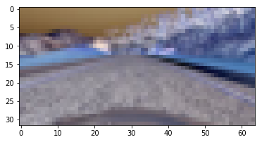
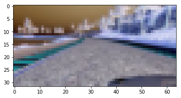
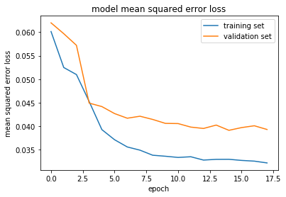

Time: January 2016
Name:Cuiqing Li

In this project, I will train data sets of photos taken from cameras of the simulation cars using neural network model, and then output the steer angle of the cars! Then, save my model data into a file, and test my model in my simulation car software to see whether my neural network have good performance

you can download your software for training data in this website:https://d17h27t6h515a5.cloudfront.net/topher/2016/(Linux)November/5831f0f7_simulator-linux/simulator-linux.zip, and make sure the IMG folder is in the same directory as self_driving_car_simulation directory. 

### Data Processing:
As for the image data, I need to read all the image files from log file, and then extract angle values for every pictures. After that I need to get data from IMG file, and resize my IMG file into 32*64 so that the model can be trained in my CPU computer. If not, it is a liitle slow. Originally, I use 160*320 size to train my model, but the data's total size exceeds my PC's memory when training. That's why I changed it into 32*64,but it is not bad at the end. 
Here is two pictures to show the extracted image data after precessing:

### Let's take a look at my neural network model:

cropping2d_9 (Cropping2D)        (None, 22, 64, 3)     0           cropping2d_input_9[0][0]         
____________________________________________________________________________________________________
batchnormalization_9 (BatchNorma (None, 22, 64, 3)     88          cropping2d_9[0][0]               
____________________________________________________________________________________________________
convolution2d_50 (Convolution2D) (None, 20, 62, 8)     224         batchnormalization_9[0][0]       
____________________________________________________________________________________________________
dropout_40 (Dropout)             (None, 20, 62, 8)     0           convolution2d_50[0][0]           
____________________________________________________________________________________________________
convolution2d_51 (Convolution2D) (None, 18, 60, 8)     584         dropout_40[0][0]                 
____________________________________________________________________________________________________
dropout_41 (Dropout)             (None, 18, 60, 8)     0           convolution2d_51[0][0]           
____________________________________________________________________________________________________
convolution2d_52 (Convolution2D) (None, 16, 58, 16)    1168        dropout_41[0][0]                 
____________________________________________________________________________________________________
dropout_42 (Dropout)             (None, 16, 58, 16)    0           convolution2d_52[0][0]           
____________________________________________________________________________________________________
convolution2d_53 (Convolution2D) (None, 14, 56, 24)    3480        dropout_42[0][0]                 
____________________________________________________________________________________________________
dropout_43 (Dropout)             (None, 14, 56, 24)    0           convolution2d_53[0][0]           
____________________________________________________________________________________________________
convolution2d_54 (Convolution2D) (None, 12, 54, 36)    7812        dropout_43[0][0]                 
____________________________________________________________________________________________________
maxpooling2d_2 (MaxPooling2D)    (None, 6, 27, 36)     0           convolution2d_54[0][0]           
____________________________________________________________________________________________________
convolution2d_55 (Convolution2D) (None, 5, 26, 45)     6525        maxpooling2d_2[0][0]             
____________________________________________________________________________________________________
dropout_44 (Dropout)             (None, 5, 26, 45)     0           convolution2d_55[0][0]           
____________________________________________________________________________________________________
convolution2d_56 (Convolution2D) (None, 4, 25, 45)     8145        dropout_44[0][0]                 
____________________________________________________________________________________________________
flatten_6 (Flatten)              (None, 4500)          0           convolution2d_56[0][0]           
____________________________________________________________________________________________________
dense_16 (Dense)                 (None, 560)           2520560     flatten_6[0][0]                  
____________________________________________________________________________________________________
dropout_45 (Dropout)             (None, 560)           0           dense_16[0][0]                   
____________________________________________________________________________________________________
activation_11 (Activation)       (None, 560)           0           dropout_45[0][0]                 
____________________________________________________________________________________________________
dense_17 (Dense)                 (None, 10)            5610        activation_11[0][0]              
____________________________________________________________________________________________________
activation_12 (Activation)       (None, 10)            0           dense_17[0][0]                   
____________________________________________________________________________________________________
dense_18 (Dense)                 (None, 1)             11          activation_12[0][0]              

Total params: 2,554,207
Trainable params: 2,554,163
Non-trainable params: 44

You will see that the neural network has input size 32*64, but I cropped the 10 pixels from top for every picture, and it turns out that it is very useful since the the top 10 rows' pixels are not very useful in this case

### final loss and val_loss data:
Also, I drawed a picture to show how loss and validation loss change over training my neural model:

This project is from udacity! 